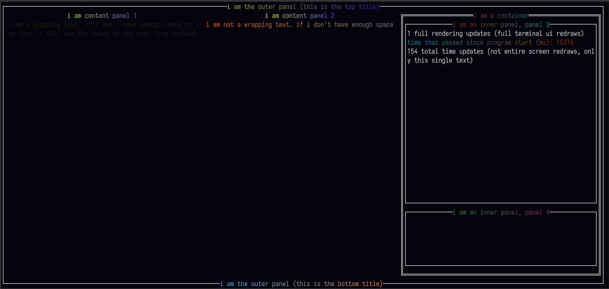

# JTux
Java Terminal UX (JTux) - A TUI library made in java

## Information
This library is still WIP! Documentation and further explanation coming soon.

### Example
This UI was rendered fully inside of a terminal.

